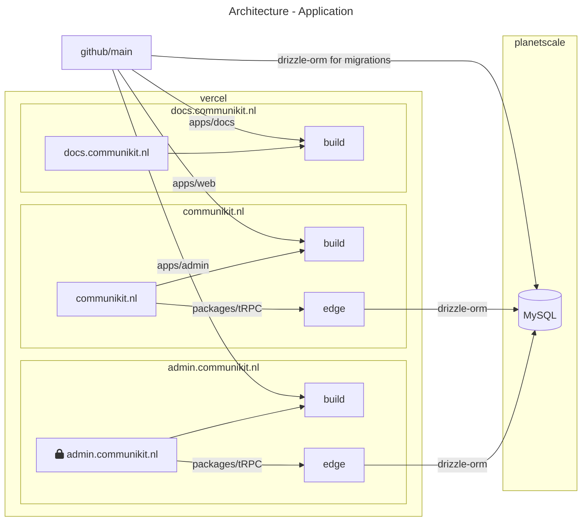

# Architecture

```mermaid
---
title: Architecture - Application
---
flowchart LR
    c[communikit.nl]
    ac[fa:fa-lock admin.communikit.nl]
    dc[docs.communikit.nl]
    main[github/main]

    main -- apps/web --> c/build
    main -- apps/admin --> ac/build
    main -- apps/docs --> dc/build

    subgraph vercel
      subgraph communikit.nl
        c
        c/build[build]
        c/edge[edge]
      end

      subgraph admin.communikit.nl
        ac
        ac/build[build]
        ac/edge[edge]
      end

      subgraph docs.communikit.nl
        dc
        dc/build[build]
      end
    end

    c --> c/build
    ac --> ac/build
    dc --> dc/build
    
    subgraph planetscale
      db[(DB)]
    end

    main -- drizzle-orm for migrations --> db[(MySQL)]

    c -- packages/tRPC --> c/edge
    ac -- packages/tRPC --> ac/edge

    c/edge -- drizzle-orm --> db
    ac/edge -- drizzle-orm --> db
```