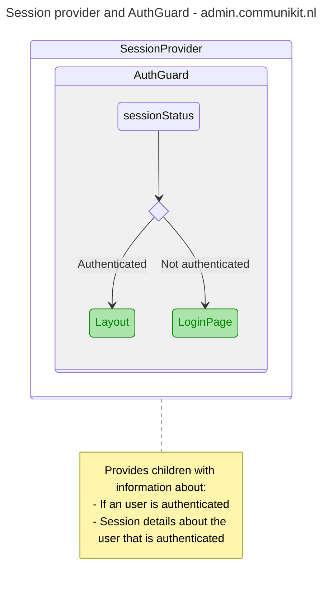
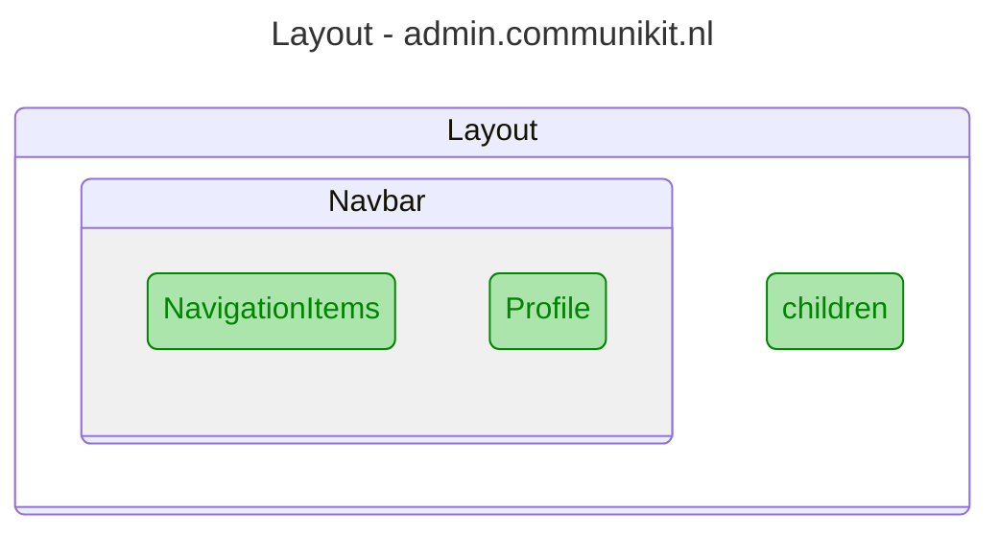

[&larr; Back](../README.md)

```mermaid
---
title: Session provider and AuthGuard - admin.communikit.nl
---
stateDiagram-v2
  classDef rendered fill:#ACE5AC,stroke:#008500,color:#008500

  state SessionProvider {
    state AuthGuard {
      state isAuthenticated <<choice>>
      sessionStatus --> isAuthenticated
      isAuthenticated --> Layout : Authenticated
      isAuthenticated --> LoginPage : Not authenticated
    }
  }

  note right of SessionProvider
    Provides children with information about:
    - If an user is authenticated
    - Session details about the user that is authenticated
  end note

  class Layout rendered
  class LoginPage rendered
```

```mermaid
---
title: Layout - admin.communikit.nl
---
stateDiagram-v2
  classDef rendered fill:#ACE5AC,stroke:#008500,color:#008500

  state Layout {
    state Navbar {
      NavigationItems
      Profile
    }

    children
  }

  class NavigationItems rendered
  class Profile rendered
  class children rendered
```
