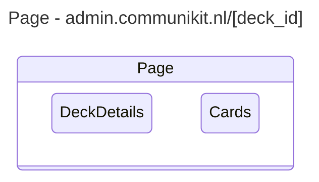

[&larr; Back](../README.md)

# [deck] (/[deck])

```mermaid
---
title: Page - admin.communikit.nl/[deck_id]
---
stateDiagram-v2
  classDef rendered fill:#ACE5AC,stroke:#008500,color:#008500

  state Page {
    DeckDetails
    Cards
  }

  class Decks rendered
```
