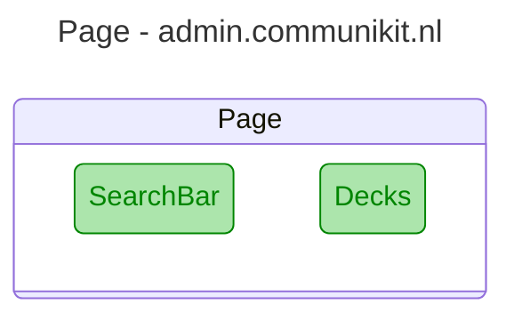

[&larr; Back](../README.md)

# Root (/)

```mermaid
---
title: Page - admin.communikit.nl
---
stateDiagram-v2
  classDef rendered fill:#ACE5AC,stroke:#008500,color:#008500

  state Page {
    SearchBar
    Decks
  }

  class SearchBar rendered
  class Decks rendered
```