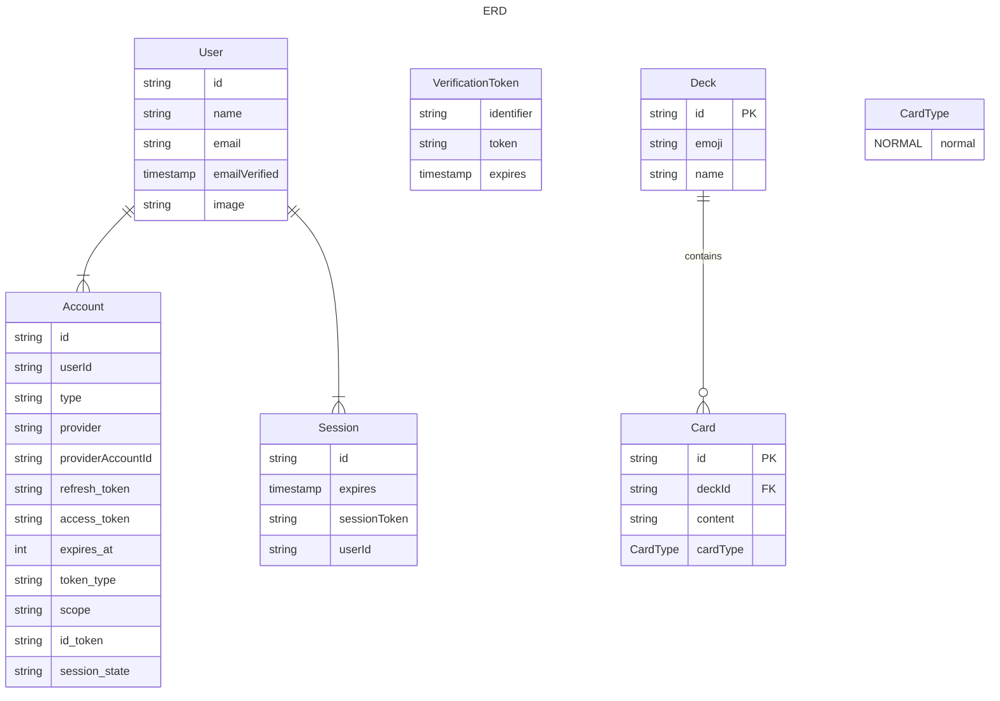

```mermaid
---
title: ERD
---
erDiagram
  User {
    string id
    string name
    string email
    timestamp emailVerified
    string image    
  }

  Account {
    string id
    string userId
    string type
    string provider
    string providerAccountId
    string refresh_token
    string access_token
    int expires_at
    string token_type
    string scope
    string id_token
    string session_state
  }

  Session {
    string id
    timestamp expires
    string sessionToken
    string userId
  }

  VerificationToken {
    string identifier
    string token
    timestamp expires
  }

  User ||--|{ Account : ""
  User ||--|{ Session : ""

  Deck {
    string id PK
    
    string emoji
    string name
  }

  Card {
    string id PK
    string deckId FK

    string content
    CardType cardType
  }

  CardType {
    NORMAL normal
  }

  Deck ||--o{ Card : "contains"
```